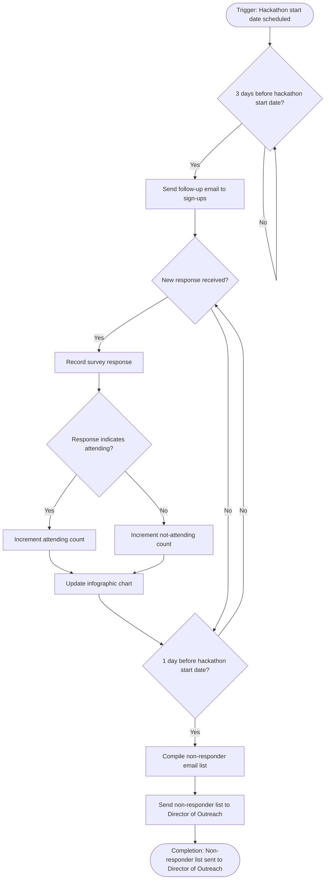

# Workflow of Tasks

*Replace all bracketed prompts with information specific to your proposed system. Delete instructional text that does not belong in your final specification. Add or remove task sections as needed. Every task shown in the general workflow must have a corresponding task specification below.*

## 1. Workflow Overview
### 1.1 Workflow Goal
This workflow supports the system goal defined in `my_first_agent/README.md`.

### 1.2 Workflow Trigger

A student fills out the attendance form and lists their email. 

### 1.3 Completion Condition at Runtime

The workflow is completed when the list of all non-responses has been sent to CPVC's director of outreach.  

### 1.4 General Workflow

Exactly three days prior to the Hackathon start date, the system will send out a follow-up email to all current sign-ups. The email will ask one question: "Do you plan on attending CPVC's Upcoming Hackathon on [Insert Date, Insert Time, Insert Location]?" The system will continuously record the answers to this survey and use the data to create an infographic chart showing the number of people attending and the number of people no longer planning to attend. 

One day before the start of a hackathon, the system will compile a list of all emails of students who have not responded and will send the list to CPVC's director of outreach. 

### 1.5 Workflow Diagram

